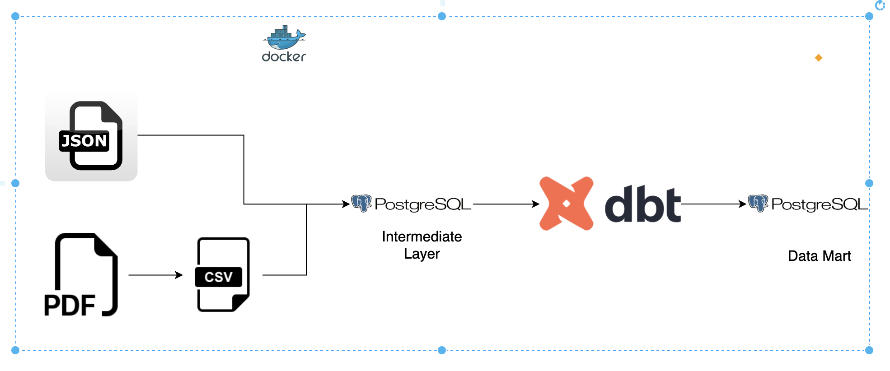

# Project Setup Guide

## Overview
This project involves setting up **dbt (Data Build Tool)** inside a Docker container, running transformations on **PostgreSQL**, and serving **dbt docs** for visualization.

## Architecture



## Solution to the Assessment
### Question 1


## Setup Instructions

### 1. Run this command to get started
```sh
docker compose up --build
```
More details about the project can be found in the github repository

